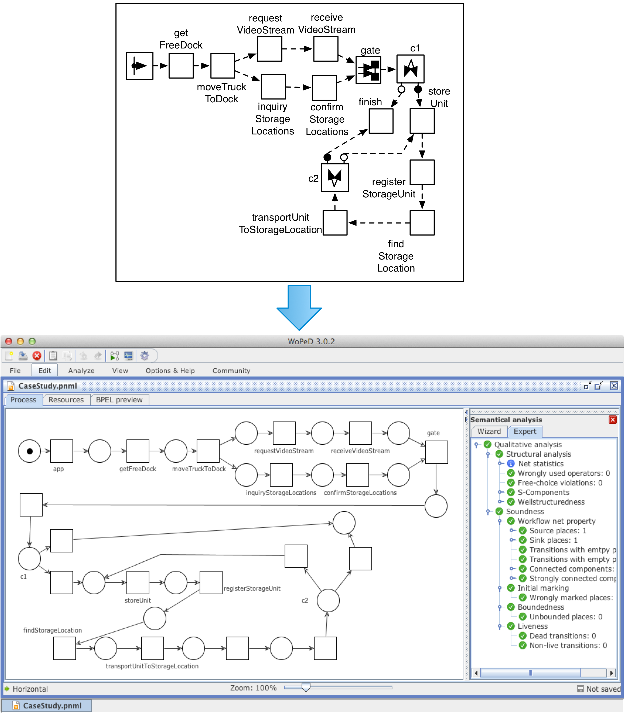

# DERA: Theoretical Part

# Introduction

_Event-based communication styles_ are potential solutions for facilitating high flexibility, scalability, and concurrency of distributed systems due to the intrinsic loose coupling of the participants. Moreover, the loose coupling nature enables better support for changes at run-time. Unfortunately, there are numerous modeling and development challenges. On the one hand, software engineers often find the event-driven communication style _unintuitive_ (with respect to other paradigms such as remote procedure calls, remote method invocations, or messaging), especially for large and complex systems with numerous constituting elements, because of its non-deterministic characteristics. On the other hand, existing methods and techniques for analyzing and understanding event-based software systems mainly focus on low-level interactions such as [Pub/Sub](http://en.wikipedia.org/wiki/Publish%E2%80%93subscribe_pattern) and/or [message passing](http://en.wikipedia.org/wiki/Message_passing) models. The lack of high-level abstractions and notations hinder the maximum leverage of event-based systems.

Dynamic Event-driven Actors (DERA) is an approach aiming at providing adequate means for modeling and developing (distributed) event-based systems. DERA leverages the intrinsic loose coupling of event-driven communication styles to support _various kinds of run-time evolution and adaptation_ (i.e., enabling run-time flexibility) while _minimizing the non-deterministic nature of traditional event-based applications_ (for supporting formal analysis).

In particular, well-defined communication interfaces of actors are introduced in order to enable us to capture a representation of a DERA system at a certain point in time for a variety of purposes such as monitoring and formal analysis. This does not reduce the flexibility of event-based systems as actors’ interfaces can be changed at any point in time.

# Basic concepts

The first-class concepts of DERA are _**event actors**_ and _**events**_ . An event actor (or actor for short) is the abstraction of a computational unit that performs a certain task (e.g., invoking a service, accessing data, transforming data, etc.). The execution of an event actor is often triggered by its input events. At the end of its execution, an actor will emit some events that in turn may trigger other actors.

A DERA system can be considered as either a collection of related event actors and events. The flexibility of DERA relies on the idea that each event actor concentrates on its own task, its required events, and the events that it is going to emit. There are no _physical_ dependencies among actors except the _conceptual_ links that are captured by analyzing their inputs and outputs. The loose coupling among event actors aims at a better scalability of DERA. That is, event actors can be distributed for better load balancing and/or optimal performance. For better run-time governance activities such as deployment, management, monitoring, and so on, event actors and events can be grouped into logical units, namely, DERA _**execution domain**_ . An execution domain can embrace one or many DERA actors and events and is enacted by an underlying DERA engine. Two different DERA execution domains can interact by having appropriate _**event bridges**_ – special actors that can transport events (with or without filtering the flow of events) from one execution domain to another.

# DERA in Action

## Distributed Execution

Inside a typical DERA execution domain, there are several event actor sharing one or many event channels. An actor can wait for (or require) one or a number of events. Its execution will be triggered whenever the required events are available. After its execution, the event actor will emit all of its output events, which in turns can trigger the execution of other actors. As a result, the particular flow of execution of a number of event actors can be used to fulfill a certain business task. We can logically define a DERA application by specifying one or many starting events and ending events. The execution of a DERA application can be distributed over several DERA execution domains in order to achieve better performance or throughput. The connection between DERA execution domains is achieved by using event bridges.

## Formal Analysis Support

For formal verification, DERA concepts and notations can be mapped to existing formalisms for concurrent systems such as [CSP](http://en.wikipedia.org/wiki/Communicating_Sequential_Processes), [CCS](http://en.wikipedia.org/wiki/Calculus_of_Communicating_Systems), [Π-calculus](http://en.wikipedia.org/wiki/%CE%A0-calculus), [Petri Nets](http://en.wikipedia.org/wiki/Petri_net), to name but a few.

One of our recent studies reported our first attempt in mapping a DERA description onto Petri nets. Petri nets provide sufficient expressiveness for modeling the DERA constructs, and they are extensively studied and used in both academia and industry in various application domains. As a result, we can benefit from numerous analysis techniques that have been developed for Petri Nets as well as a plethora of [verification tools](http://www.informatik.uni-hamburg.de/TGI/PetriNets/tools/db.html).

The picture depicts a snapshot of a DERA application captured at certain point in time and translated into Petri nets for verification using the tool [WoPeD](http://woped.dhbw-karlsruhe.de/woped).

# Related Techniques

The notion of _action_ is borrowed from the [Actor model](http://en.wikipedia.org/wiki/Actor_model) proposed by [Carl Hewitt](http://en.wikipedia.org/wiki/Carl_Hewitt) and follow-on studies. The distinction between DERA model and Actor model can be summarized as following.

*   DERA actors (or more precisely, event-based actors) do not know each other (i.e. a DERA actor is unaware of the existence of the other actors)
*   Communication among DERA actors are carried out by sending/receiving events via event channels
*   The interfaces of a DERA actor is explicitly defined and can be changed at any point in time.
*   A DERA actor is not allowed to create new actors
*   The computation attached to a DERA actor is triggered by the incoming events, not by the will of the containing actor.
*   The output events are emitted _AFTER_ the execution of the computation attached to a DERA actor (if any), not by the will of the containing actor (in some special cases, for instance, actors defined for describing control flow such as _decision/if-then-else_, the output events depend on the value of the predicates attached to the corresponding actors).

# Publications

1.  H. Tran and U. Zdun, “ [Event-driven Actors for Supporting Flexibility and Scalability in Service-based Integration Architecture](http://link.springer.com/chapter/10.1007/978-3-642-33606-5_11)“. In CoopIS: Proceedings of the 20th International Conference on Cooperative Information Systems, 2012, pp. 164–181.
2.  H. Tran and U. Zdun, “ [Event Actors Based Approach for Supporting Analysis and Verification of Event-Driven Architectures](http://dl.acm.org/citation.cfm?id=2547437)“. In EDOC: Proceedings of the 17th IEEE International Enterprise Distributed Object Computing Conference (EDOC), Vancouver, Canada, pp. 217-226, 2013.
